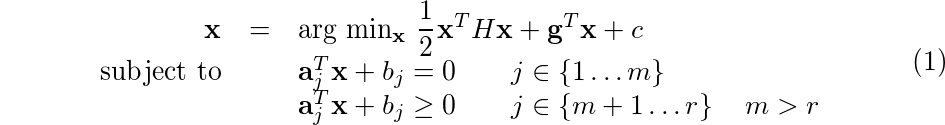

# Optimization

This is an implementation for common constrained optimization in `Ruby`. Even if it is not common to derive numerical stuff using such a language (I'm aware of that :smiley:), I'm using it only to better understand which should be the final design (from a software engineering point of view) when I'll dive into deep C++ code (probably it will be in another repo... I'll keep you informed).

My intention are to build:

 * a **general quadratic optimizer**
 * an **augmented Lagrange optimizer** (that is the final objective)

## `Optimization` module

As for now, only `Ruby` code is available. In `function.rb` file a foundation class for non-linear function is derived. From that base definition, I've expanded the concept of **Linear** and **Quadratic** functions prototype class, in which derivative are evaluated analytically.

As for now we have:

 * `Optimization::Function`
 * `Optimization::LinearFunction`
 * `Optimization::QuadraticFunction`

Remarkable is the fact that also **Objective** and **Constraint** function prototype class are defined. While **Objective**s are perfect carbon copy of general function prototype, **Constraint**s contain also:

 * `lambda`: lagrange multiplier is part of the constraint itself
 * `#active?(x)`: method, returns true if constraint is active.

Maybe I should implement some sort of memory inside each function, to keep track of what append during optimization problem, or just an update function that forces to store last evaluation. We will see. All those stuff could be inherited from the parent `Optimization::Function`.

## Next step

Next step will be to derive, in sequence:

 * **basic quadratic optimization**
 * **general quadratic optimization**

Than, probably I will define a class for penalty functions, and I'll go straight to the definition of a complete augmented lagrangian method.

I hope I'll succeed... :smiley:

### Quadratic optimization

This class is born to resolve problem in the form:



## Docs

If you run:

```
rake doc
```

the RDoc documentation will be built. This require `rake` and `rdoc` gems installed.
