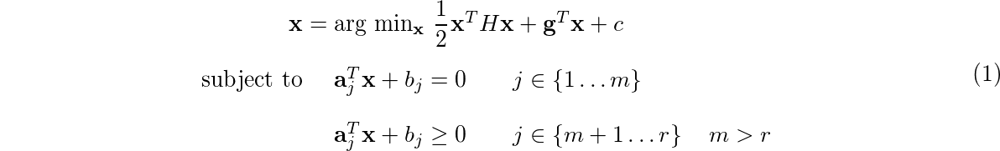
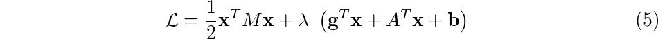
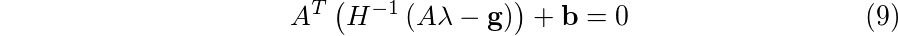
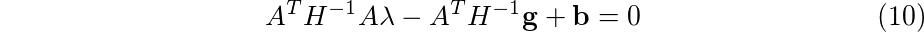
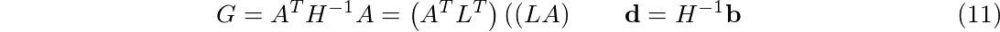
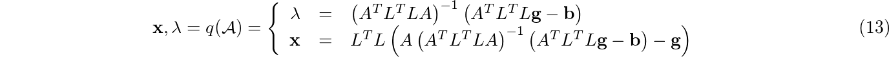
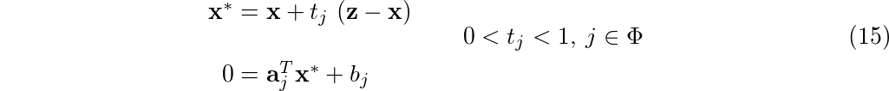
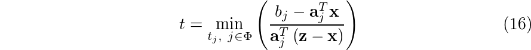

# Optimization

This is an implementation for common constrained optimization in `Ruby`. Even if it is not common to derive numerical stuff using such a language (I'm aware of that :smiley:), I'm using it only to better understand which should be the final design (from a software engineering point of view) when I'll dive into deep C++ code (probably it will be in another repo... I'll keep you informed).

My intention are to build:

 * a **general quadratic optimizer**
 * an **augmented Lagrange optimizer** (that is the final objective)

## `Optimization` module

As for now, only `Ruby` code is available. In `function.rb` file a foundation class for non-linear function is derived. From that base definition, I've expanded the concept of **Linear** and **Quadratic** functions prototype class, in which derivative are evaluated analytically.

As for now we have:

 * `Optimization::Function`
 * `Optimization::LinearFunction`
 * `Optimization::QuadraticFunction`

Remarkable is the fact that also **Objective** and **Constraint** function prototype class are defined. While **Objective**s are perfect carbon copy of general function prototype, **Constraint**s contain also:

 * `lambda`: lagrange multiplier is part of the constraint itself
 * `#active?(x)`: method, returns true if constraint is active.

Maybe I should implement some sort of memory inside each function, to keep track of what append during optimization problem, or just an update function that forces to store last evaluation. We will see. All those stuff could be inherited from the parent `Optimization::Function`.

## Next step

Next step will be to derive, in sequence:

 * **basic quadratic optimization**
 * **general quadratic optimization**

Than, probably I will define a class for penalty functions, and I'll go straight to the definition of a complete augmented lagrangian method.

I hope I'll succeed... :smiley:

### Quadratic optimization

> Not implemented yet

#### Problem formulation

This class is born to resolve problem in the form:



It is called **feasible set** the domain identified by the constraints of the problem (**x** is **feasible** if respects _all constraints_).

#### Active set sub-problem

The first definition we must give is about the so called **active set**. This set is about the equations that are _active_ given an point **z**:


from the **active set** we create the constraint matrix _A_ and **b** for the sub-problem:


such that we have a new simpler optimization to solve, with only equality constraints:


that is solved in lagrangian form:



with _H_ symmetric part of the _M_ matrix. The system that must be solved:


#### Sub-problem solution

In sub-problem solution is possible to identify:

 * fixed elements, such as _H_, **g**
 * variable elements in function of the **active set**: _A_, **b**

In particular, _H_, that is a positive definite matrix (or at limit semi-positive definite), should be directly decomposed using Cholesky's method:


Solving the equation _(6.a)_ for **x** gives us:


and using this solution in _(6.b)_:







we obtain the final solution for this problem:


The final solution for the optimization problem stated in _(4)_ is the following:



Solution of _(13)_ will be called also: **x**, _λ_ = k()

#### From active set to feasible set

Once we have solved for the active set, we have to check that found solution satisfies all the constraints (i.e.: **x** belongs to the feasible set described by equations _(1.b, 1.c)_). If the solution of optimization sub-problem does not satisfies the complete optimization problem (i.e.: due to some ignored constraints), we have to identify the best nearest solution. This is done through a line search. Given _Φ_ as the set of violated constraints:


It can be used as method to choose the best solution the system of equations:



this is valid searching direction due to problem linearity. Solving for _t_ leads to:



as algorithm:

```ruby
# This is only a Ruby "pseudocode"
# Suppose constraints visible as at[j], b[j]
# Suppose Φ visible

def best_on_line(z, x)
  t_set = []
  Φ.each do |j|
    t_set << (b[j] - at[j] * x) / (at[j] * (z - x))
  end
  return x + t_set.min * (z - x)
end
```

The new active constraint must be added to the **active set**. If more index share the same value of _t_, than all indexes must be added to the **active set**.

#### Quadratic programming algorithm

The strategy could be implemented as follows:

``` ruby
# This is only a Ruby "pseudocode"

def GeneralQuadratic( x0 )
  x = x0                                  # Initial point must be feasible
  L = cholesky(H)**(-1)

  activeSet = active_set(x)               # cf. equation (2)
  feasibleSet = feasible_set(x)           # cf. equation (1.b, 1.c)

  while true
    z, λ = q(activeSet)                   # cf. equation (13)

    if violates_constraints?(z)
      x = best_on_line(z, x)                 # cf. equation (16)
      activeSet = active_set(x)

    else
      x = z
      feasibleSet = []
      activeSet.each do |j|
        feasibleSet << j if λ[j] < 0      # check if an active constraint
                                          # is not active
      end

      if feasibleSet == []
        break
      else
        activeSet = activeSet - feasibleSet
      end
    end
  end
  return x
end
```

## Docs

There is a `rake` task to create documentation:

```
rake doc
```

the RDoc documentation will be built. This require `rake` and `rdoc` gems installed.

## References
