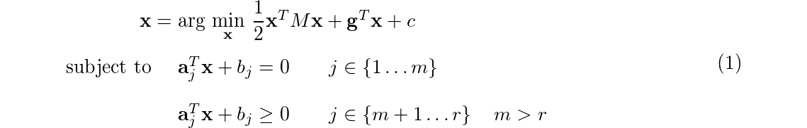
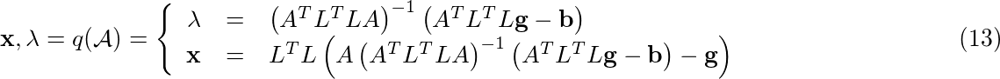

# Optimization

This is an implementation for common constrained optimization in `Ruby`. Even if it is not common to derive numerical stuff using such a language (I'm aware of that :smiley:), I'm using it only to better understand which should be the final design (from a software engineering point of view) when I'll dive into deep C++ code (probably it will be in another repo... I'll keep you informed).

My intention are to build:

 * a **general quadratic optimizer**
 * an **augmented Lagrange optimizer** (that is the final objective)

## `Optimization` module

As for now, only `Ruby` code is available. In `function.rb` file a foundation class for non-linear function is derived. From that base definition, I've expanded the concept of **Linear** and **Quadratic** functions prototype class, in which derivative are evaluated analytically.

As for now we have:

 * `Optimization::Function`
 * `Optimization::LinearFunction`
 * `Optimization::QuadraticFunction`

Remarkable is the fact that also **Objective** and **Constraint** function prototype class are defined. While **Objective**s are perfect carbon copy of general function prototype, **Constraint**s contain also:

 * `lambda`: lagrange multiplier is part of the constraint itself
 * `#active?(x)`: method, returns true if constraint is active.

Maybe I should implement some sort of memory inside each function, to keep track of what append during optimization problem, or just an update function that forces to store last evaluation. We will see. All those stuff could be inherited from the parent `Optimization::Function`.

## Next step

Next step will be to derive, in sequence:

 * **basic quadratic optimization**
 * **general quadratic optimization**

Than, probably I will define a class for penalty functions, and I'll go straight to the definition of a complete augmented lagrangian method.

I hope I'll succeed... :smiley:

### Quadratic optimization

> Not implemented yet

#### Problem formulation

This class is born to resolve problem in the form:



#### Active set sub-problem

The first definition we must give is about the so called **active set**. This set is about the equations that are _active_ given an point **z**:


from the **active set** we create the constraint matrix _A_ and **b** for the sub-problem:


such that we have a new simpler optimization to solve, with only equality constraints:


that is solved in lagrangian form:


that leads us to the system that must be solved:


#### Sub-problem solution

In sub-problem solution is possible to identify:

 * fixed elements, such as _H_, **g**
 * variable elements in function of the **active set**: _A_, **b**

In particular, _H_, that is a positive definite matrix (or at limit semi-positive definite), should be directly decomposed using Cholesky's method:


Solving the equation _(6.a)_ for **x** gives us:


and using this solution in _(6.b)_:


we obtain the final solution for this problem:


When everything is together, the final solution for the optimization problem stated in _(4)_ is the following:




## Docs

There is a `rake` task to create documentation:

```
rake doc
```

the RDoc documentation will be built. This require `rake` and `rdoc` gems installed.

## References
